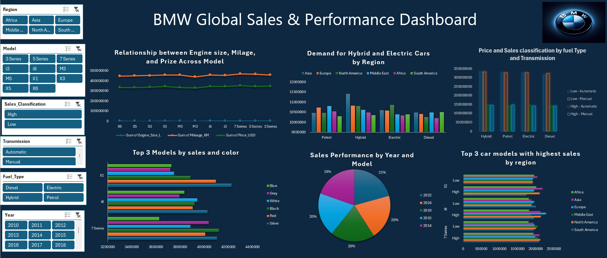
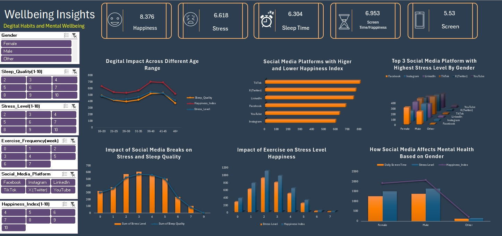
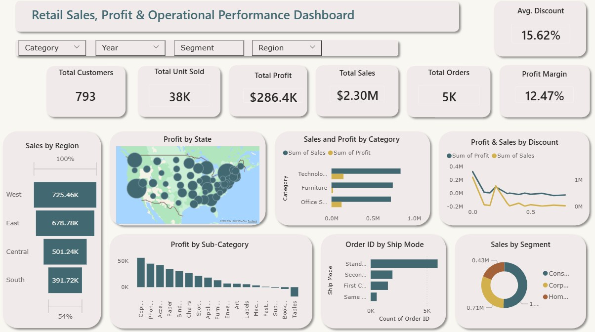
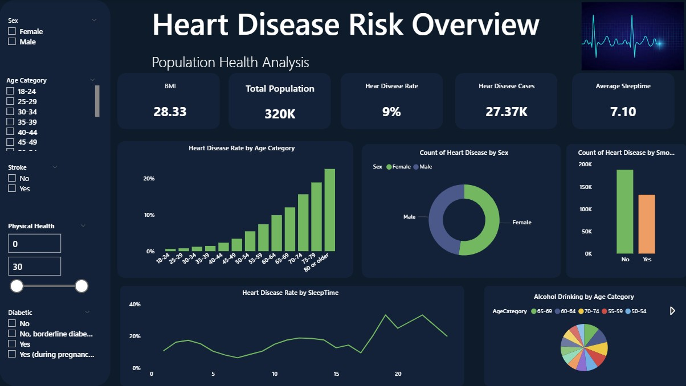

# Project 1

**Title:** [BMW Global Sales & Performance Dashboard](https://github.com/Henrysylvia/henrysylvia.github.io/blob/main/BMW%20sales%20data%20(2010-2024)%20(1).xlsx)

**Tools Used:** MicroSoft Excel (Pivot Table, Pivot Chart, Slicers, Data Cleaning & Preparation, Conditional Formating, Line Chart, Bar charts, Pie Chart, and Clustered Column Chart)

**Project Description:** This project analysed BMW’s global sales and performance data to understand market trends, model performance, and customer demand across regions, fuel types, and transmission types. Built in Excel, the dashboard turns a multi-dimensional dataset into an interactive view of key metrics such as pricing, engine size, mileage, sales volume, and colour preferences.

Users can explore performance by region, model, and year, and examine how technical features and fuel types relate to sales outcomes. Interactive slicers support quick comparisons and help identify high‑performing segments and emerging opportunities.
Key features include:

•	Regional sales overview: Comparison of sales across major global regions.

•	Model performance: Sales trends across BMW’s core model ranges.

•	Engine, mileage and price insights: Relationships between technical specifications and pricing.

•	Fuel type and transmission breakdown: Sales distribution across Petrol, Diesel, Hybrid, Electric, and Automatic vs Manual.

•	Hybrid and electric demand: Regional interest in sustainable vehicle options.

•	Year-on-year trends: Sales performance across multiple years.

•	Interactive filtering: Slicers for region, model, year, fuel type, transmission, and sales classification.

**Key findings:** 

•	Sales performance varies significantly by region: Some markets consistently outperform others, reinforcing the need for region specific sales and marketing strategies.

•	Engine size, mileage, and pricing show clear relationships: Larger engines and higher mileage generally align with higher pricing, reflecting expected performance driven pricing patterns.

•	Hybrid and electric vehicles show growing demand: Certain regions demonstrate strong interest in sustainable vehicle options, signalling a shift toward low emission models.

•	Fuel type and transmission influence sales classification: Automatic vehicles, especially petrol and hybrid, are more commonly associated with higher sales classifications, suggesting a preference for convenience and performance.

•	A few top models drive most of the sales: A small number of models contribute a large share of total sales, making them central to BMW’s global revenue.

•	Colour preferences influence purchasing decisions: Sales patterns show that colour choice plays a role in customer behaviour, particularly for top selling models.

•	Sales remain steady across multiple years: Year on year performance shows stability rather than volatility, reflecting strong brand positioning and consistent demand.

**Dashboard Overview:**

# Project 2

**Title:** [Wellbeing Insights: Degital Habits and Mental Wellbeing](https://github.com/Henrysylvia/henrysylvia.github.io/blob/main/Wellbeing%20Insights%20Dashboards.xlsx)

**Tools Used:** MicroSoft Excel (KPIs, Pivot Table, Pivot Chart, Slicers, Data Cleaning & Preparation, Conditional Formating, Line chart, 3-D Clustered Bar, 3-D Column, and Custom Combination)

**Project Description:** This project focused on analysing digital habits and wellbeing data to understand how screen time, social media use, sleep quality, exercise, and demographic factors relate to overall mental wellbeing. The work was completed in Excel, using formulas, calculated fields, and interactive visuals to turn raw survey-style data into clear, practical insights.

The dashboard brings together key wellbeing indicators such as happiness, stress levels, sleep duration, screen time, and exercise frequency, and shows how these differ across age groups, gender, and social media platforms. It was designed to help users explore patterns and relationships in the data, making it easier to identify behaviours linked to higher stress or improved wellbeing.
Key features of the dashboard include:

•	Overall wellbeing KPIs: Summary metrics showing average happiness, stress, sleep time, and screen time.

•	Demographic analysis: Wellbeing indicators broken down by gender and age range to highlight group-level trends.

•	Digital behaviour insights: Comparison of social media platforms to understand their relationship with happiness and stress.

•	Lifestyle factors: Exploration of how exercise frequency and social media breaks influence stress and sleep quality.

•	Interactive filtering: Slicers for gender, age, sleep quality, stress level, exercise frequency, happiness index, and platform to support flexible analysis.

The dashboard supports discussions around digital wellbeing and can be used to inform wellbeing programmes, workplace initiatives, or behavioural research.

**Key findings:** 

•	Digital habits are closely linked to wellbeing: Higher screen time and certain platforms are associated with increased stress and lower happiness, suggesting that digital behaviour plays a meaningful role in mental wellbeing.

•	Wellbeing patterns vary by age: Stress, sleep quality, and happiness differ across age groups, with some groups showing higher stress alongside reduced sleep, pointing to the value of age specific wellbeing support.

•	Different platforms have different impacts: Social media platforms show distinct relationships with happiness and stress, indicating that the type of platform used matters as much as the amount of time spent.

•	Exercise contributes to better wellbeing: More frequent exercise is linked to higher happiness and lower stress, reinforcing its role as a protective factor for mental health.

•	Taking breaks from social media helps: People who take regular breaks report better sleep and lower stress, showing that small adjustments in digital habits can have positive effects.

•	Gender differences are evident: Stress levels, happiness, and screen time vary across genders, highlighting the importance of considering demographic context when interpreting wellbeing data.

**Dashboard Overview:**

# Project 3

**Title:** Employee Table: Data Manipulation and Interrogation

**SQL Code:** [Employee Table SQL Codes](https://github.com/Henrysylvia/henrysylvia.github.io/blob/main/Employee.sql)

**SQL Skills Used:**

•	Data import and ETL (Excel to SQL Server) using Visual Studio: Transferred Excel datasets into SQL Server to prepare data for querying and analysis.

•	Data Retrieval and Formatting: Used SELECT, UPPER, LEFT, and string concatenation to format names and extract partial values.

•	Filtering and Pattern Matching: Applied WHERE, BETWEEN, LIKE, NOT IN, and CHARINDEX to isolate records based on conditions like salary range, name patterns, and address formatting.

•	Aggregation and Grouping: Used COUNT, GROUP BY, and ORDER BY to summarise employee counts by department and gender, and sort results by frequency or alphabetical order.

•	Date and Range Queries: Queried records based on DOB and DATEOFJOINING using BETWEEN and IS NOT NULL to filter time-based data.

•	Top-N and Extremes: Used TOP with ORDER BY to retrieve the highest and lowest salary values.

•	Table Creation: Used SELECT INTO to create a new table by copying the structure and data from an existing one.

•	Conditional Logic Across Tables: Queried both Employee_Info and Employee_Position to link demographic data with positional attributes like salary and job title.

**Project Description:** This project involved writing and testing a series of SQL queries to explore employee and position data across two related tables: Employee_Info and Employee_Position. The queries were designed to demonstrate core SQL techniques for data retrieval, transformation, filtering, aggregation, and table creation. The focus was on extracting meaningful insights from HR-related datasets, including employee demographics, departmental structures, salary ranges, and positional details.
The queries encompass a range of use cases, including formatting names, filtering by conditions, grouping, and sorting data for analysis. They also include logic for handling string manipulation, date filtering, and creating new tables from existing data.

**Technology used:** SQL server

# Project 4

**Title:** Salesman_Order_and_Customer Table: Data Manipulation and Interrogation

**SQL Code:** [Salesman_Order_and_Customer Table SQL Codes](https://github.com/Henrysylvia/henrysylvia.github.io/blob/main/Salesman_Order_and_Customer.sql)

**Skills Used:**

•	Data Import and ETL (Excel to SQL Server) using Visual Studio: Imported datasets from Excel into SQL Server to prepare the tables used for querying and analysis.

•	Relational Joins Across Multiple Tables: Combined Salesman, Customer, and Order tables using INNER JOIN, LEFT JOIN, and CROSS JOIN to analyse relationships such as shared cities, commission structures, and order activity.

•	Conditional Filtering and Business Logic: Applied WHERE, BETWEEN, comparison operators, and logical conditions to filter orders by amount, identify commission thresholds, match or mismatch cities, and select customers by grade.

•	Report Generation Using Multi Table Queries: Created structured outputs showing customer details, order information, salesperson data, and commission values, sorted and formatted for readability.

•	Aggregation and Grouping: Used grouping logic to list salespeople with or without customers, and to summarise relational data where required.

•	String and Column Formatting: Returned clean, labelled outputs using column aliases to present business friendly report fields.

•	CTE (Common Table Expression) Usage: Built a CTE to generate a filtered customer order list based on order amount and grade requirements.

•	Cartesian Products for Scenario Analysis: Used CROSS JOIN to generate combinations of salespeople and customers under specific conditions (e.g., matching cities, grade requirements, or mismatched locations).

**Project Description:** This project involved writing a series of SQL queries to analyse and report on relationships between salespeople, customers, and orders across multiple tables. The work focused on joining datasets, filtering records based on business rules, generating reports, and exploring relational patterns such as commissions, customer grades, order behaviour, and city based matching.
Using SQL Server, the queries demonstrate how to combine data from the Salesman, Customer, and Order tables to answer practical business questions, including identifying high value customers, analysing commission structures, checking order activity, and producing detailed sales reports. The project also includes the use of INNER JOIN, LEFT JOIN, CROSS JOIN, and CTEs to handle more complex logic and reporting requirements.

**Technology used:** SQL server

# Project 5

**Title:** [Retail Sales, Profit & Operational Performance Dashboard](https://github.com/Henrysylvia/henrysylvia.github.io/blob/main/Superstore.pbix)

**Tools Used:** Power BI

**Project Description:** This project analysed retail sales data to understand performance, profitability, discount patterns, and operational activity across regions, product categories, customer segments, and time periods. The analysis was presented through an interactive Power BI dashboard designed to give a clear overview of business performance while allowing users to explore underlying trends in more detail.

The dashboard brings together key commercial metrics, including total sales, profit, profit margin, order volume, units sold, customer count, and average discount, making it easy to assess overall performance and spot areas that may need attention. Filters for category, year, segment, and region support flexible comparisons across different parts of the business.
Key components include:

•	Executive KPIs: High level metrics for sales, profit, profit margin, orders, customers, units sold, and discount levels.

•	Regional Performance: Sales and profit comparison across regions, with map visuals highlighting state level trends.

•	Category & Sub Category Insights: Breakdown of sales and profit contribution to identify strong and weak product areas.

•	Discount Impact: Analysis of how discounting affects both sales volume and profitability.

•	Operational Insights: Order distribution by shipping mode to understand fulfilment patterns.

•	Customer Segmentation: Sales performance across consumer, corporate, and home office segments.

The dashboard supports data driven decision making by turning complex sales and operational data into clear, actionable insights.

**Key findings:** 

•	Sales performance differs widely by region: Some regions show consistently strong sales and profit, while others generate high sales but weaker margins, pointing to potential pricing or cost related opportunities.

•	Technology and Furniture lead revenue contribution: These categories drive the highest share of sales, though margins vary, highlighting the need to balance volume with profitability.

•	Discounting boosts sales but reduces profit: Higher discounts increase order volume but negatively impact profit margins, showing a clear trade off between growth and profitability.

•	Sub category results are mixed: Several sub categories perform strongly, while others regularly underperform or operate at a loss, suggesting areas for product review or pricing adjustments.

•	Standard shipping is the most common fulfilment method: Most orders use standard shipping, reflecting customer preference for lower cost delivery and indicating where operational demand is concentrated.

•	The consumer segment generates the most sales: Consumer customers contribute the largest share of revenue compared with corporate and home office segments, reinforcing their importance to overall performance.

**Dashboard Overview:**

# Project 6

**Title:** [Hear Disease Risk Overview](https://github.com/Henrysylvia/henrysylvia.github.io/blob/main/Heart%20Disease%20Risk.pbix)

**Tools Used:** Power BI

**Project Description:** This project analysed population health data to understand heart disease prevalence and the factors associated with increased risk. The findings were presented through an interactive Power BI dashboard designed to support population-level health insights and help users explore cardiovascular risk across different demographic, lifestyle, and clinical variables.

The dashboard brings together key indicators such as heart disease rate, total cases, average BMI, average sleep duration, and total population. Users can examine how risk varies by age, sex, sleep patterns, smoking and alcohol use, physical health scores, stroke history, and diabetic status. Interactive slicers make it easy to filter the data and identify high risk groups that may benefit from targeted prevention or public health interventions.
Key components include:

•	Population Health KPIs: Overall heart disease rate, case count, average BMI, average sleep time, and population size.

•	Age Based Risk: Heart disease prevalence across age groups to show how risk increases over time.

•	Sex Based Comparison: Differences in heart disease cases between male and female populations.

•	Lifestyle Factors: Relationships between heart disease and sleep duration, smoking, and alcohol consumption.

•	Clinical Indicators: Exploration of stroke history, diabetic status, and physical health scores as compounding risk factors.

•	Interactive Exploration: Slicers for demographic and health characteristics to support flexible, multi dimensional analysis.

The dashboard turns complex health data into clear, accessible insights that support evidence based population health planning.

**Key findings:**

•	Heart disease risk rises with age 
Prevalence increases steadily across age groups, with the highest rates in older populations.

•	Differences in prevalence by sex 
Male and female populations show distinct patterns, reinforcing the value of sex specific analysis.

•	Sleep duration shows a non linear relationship with risk 
Both short and long sleep durations are linked to higher heart disease rates.

•	Smoking is associated with higher prevalence 
Individuals with a smoking history show more heart disease cases than non smokers.

•	Clinical risk factors compound vulnerability 
Stroke history, diabetes, and lower physical health scores are all linked to higher heart disease prevalence.

•	BMI levels indicate elevated population risk 
The average BMI reflects an overweight population profile, highlighting its relevance as a cardiovascular risk factor.

**Dashboard Overview:**

